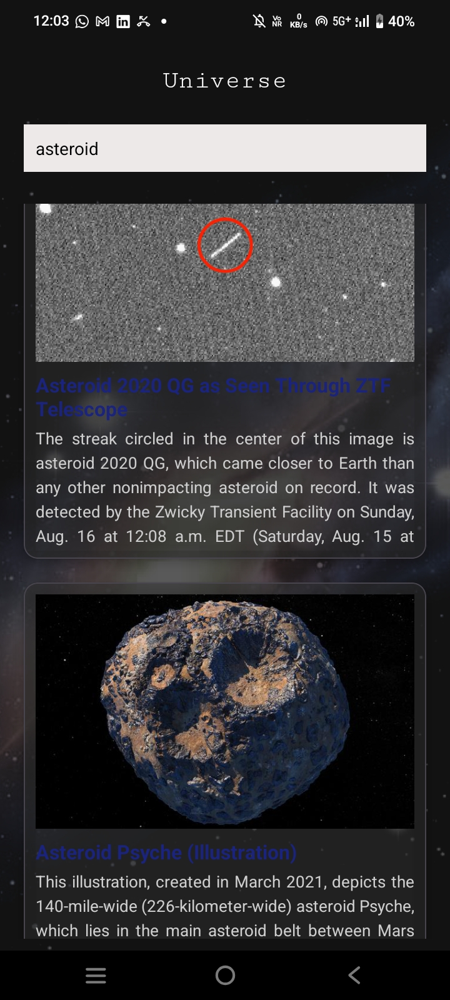
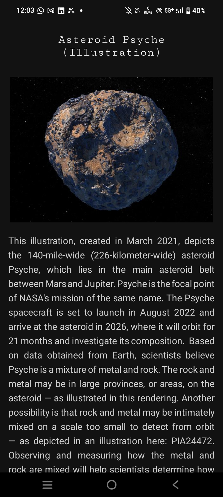

# Universe App

This is an Android application that provides information about celestial objects using real time space data from the NASA API. The app allows users to explore celestial object information.

## Features
- Fetches live universe data from NASA Open APIs  
- Displays any celestial object real information
- Clean and simple UI design  
- Fast and lightweight application  
- Educational tool for basic space data exploration

## Tech Stack
- Java (Android)
- XML UI Design
- REST API Integration

## Screenshots

#Homepage

  

#Description Page

